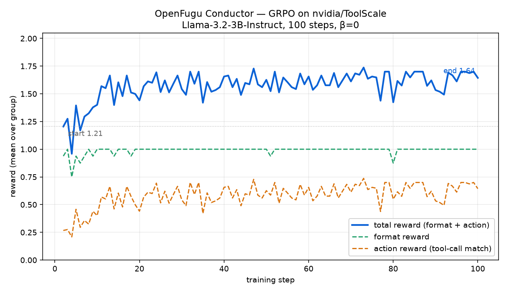

# Results

## Conductor GRPO on ToolScale

Training a Conductor (Llama-3.2-3B-Instruct) with GRPO on
[`nvidia/ToolScale`](https://huggingface.co/datasets/nvidia/ToolScale), 100
steps, β=0 (no KL — matching the Fugu-Ultra report). Reward = format reward
(`<think>…</think><answer>[json]</answer>`) + action reward (the emitted
tool-call sequence scored against the task's `evaluation_criteria.actions`).

What the curve shows:

- **format reward** saturates to **1.0 within ~3 steps** — the model quickly
  learns to emit the required `<think>/<answer>` structure.
- **action reward** climbs from **~0.27 → ~0.6** (peaks ~0.70) — it progressively
  learns to match the ground-truth tool calls.
- **total reward** rises **1.21 → 1.64** over training.

Raw per-step data: [`conductor_grpo_log.csv`](conductor_grpo_log.csv)
(step, reward, format_reward, action_reward, loss, completion_len).
Regenerate the plot: `python assets/plot_reward_curve.py <log> <out.png>`.

Trained weights: `huggingface.co/di-zhang-fdu/openfugu-conductor-3b`.

## Orchestration beats the best single model

`eval/eval_orchestration.py` — the self-trained TRINITY coordinator scores
**+107%** over the best single worker, reaching **100%** of the oracle ceiling
(see README). This is the central Fugu claim, reproduced on a coordinator we
trained ourselves.
